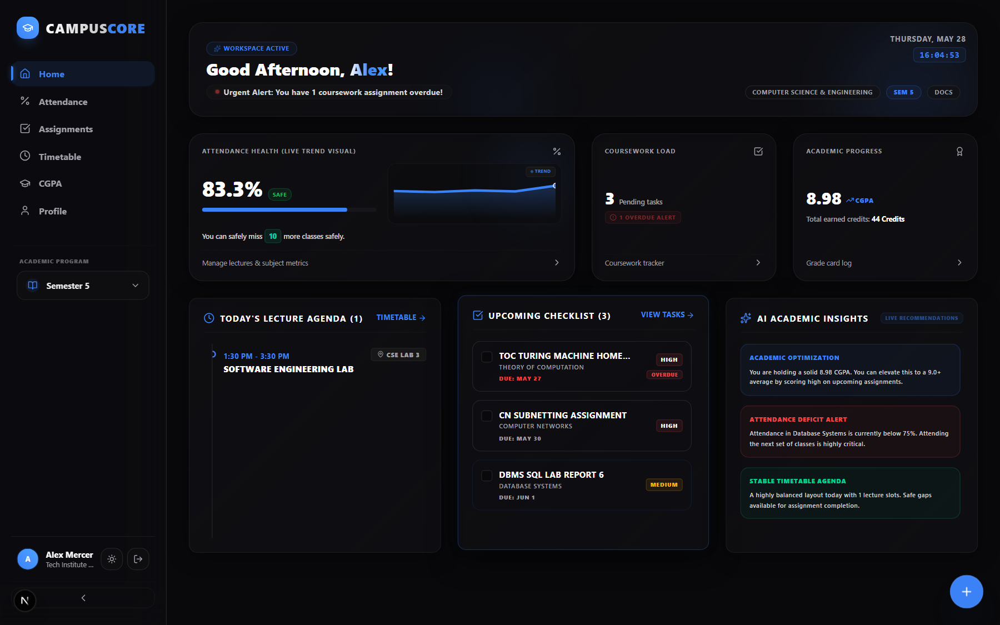
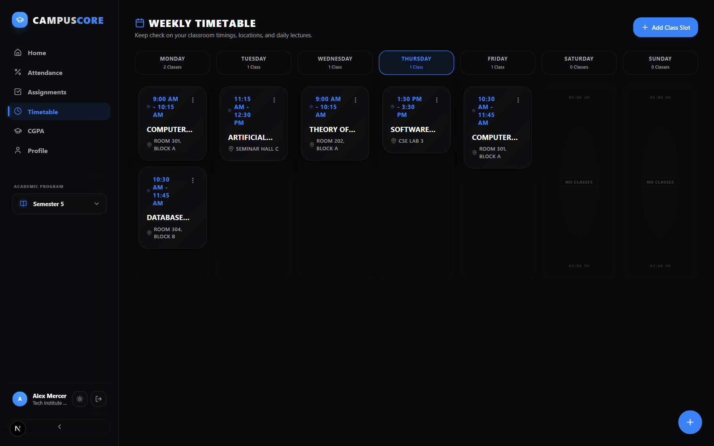
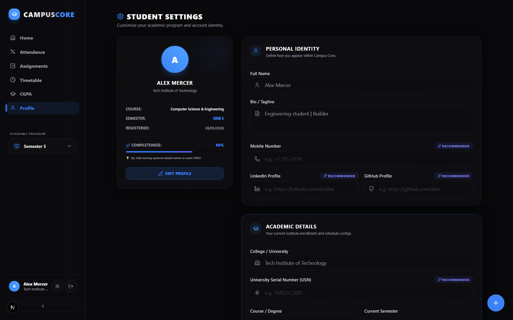

<p align="center">
  
  
  
  
  
</p>

<h1 align="center">🎓 Campus Core</h1>

<p align="center">
  <strong>The Student Operating System</strong><br/>
  <sub>A modern, premium desktop & mobile workspace for college students to manage academics, attendance, timetables, assignments, and grades — with an offline sandbox to test instantly.</sub>
</p>

<p align="center">
  🚀 <strong><a href="https://campus-core-jet.vercel.app/">Launch Live App</a></strong> •
  ⭐ <strong><a href="#-getting-started">Star The Repo</a></strong>
</p>

<p align="center">
  <a href="#-visual-tour">Visual Tour</a> •
  <a href="#-core-modules">Core Modules</a> •
  <a href="#-tech-stack">Tech Stack</a> •
  <a href="#-architecture">Architecture</a> •
  <a href="#-database-schema">Database</a> •
  <a href="#-getting-started">Getting Started</a> •
  <a href="#-roadmap">Roadmap</a>
</p>

---

## 🧠 Overview

Campus Core replaces scattered workflows involving messy college ERPs, spreadsheet GPA calculators, WhatsApp groups, manual calendar planners, and notepad tracking with a **lightning-fast, gorgeous workspace** specifically tailored for students.

### Product Philosophy
* **Minimalist Aesthetics:** High-end dark theme inspired by Vercel, Linear, and Raycast, designed to reduce cognitive load.
* **Instant Gratification:** One-click instant demo allows users to explore a pre-populated dashboard without registering.
* **Local Sandbox Fallback:** Live edits in the demo environment persist strictly inside local storage so they don't pollute database servers.
* **Optimistic Core UI:** Tab switches, assignment logs, and attendance counters update instantly on the screen before the database responds.

---

## 📸 Visual Tour

| 📊 Academic Dashboard | 📅 Responsive Weekly Planner |
|---|---|
|  |  |

| 🎒 Gamified Completeness Meter | ⚡ Cmd+K Command Search |
|---|---|
|  |  |

*(To submit screenshots of your fork, drop your PNG assets into `public/screenshots/` and update these links!)*

---

## ⚡ Core Modules

### 📊 Attendance Analytics
Stay well above the 75% threshold without manual calculations. Log and track lectures per subject.
* **Intelligent Bunksameter:** Auto-computes exactly how many classes you can afford to safely bunk or how many you must attend to stay safe.
* **Color-Coded Thresholds:** Progress meters transition dynamically from premium blue (Safe) to warning orange (Danger) and critical red (Below 75%).
* **One-Tap Quick Log:** Fast incremental buttons to record attended or missed classes on the fly.

### 🎒 Semester-Based Workspace
Advance through your degree cleanly with modular, multi-semester workspace contexts.
* **Strict Semester Isolation:** Timetables, subjects, assignments, and grades are strictly isolated under each semester level (Sem 1 to 8).
* **Workspace Switcher:** A desktop sidebar switcher and floating mobile bar let you hop back into previous semesters to view or edit historical data anytime.

### ✅ Assignment Tracking
Ensure you never miss a deadline. Manage coursework tasks using prioritizations, deadlines, and direct subject linkages.
* **Priority Matrices:** Categorize tasks under High, Medium, and Low priorities with clear glowing indicators.
* **Dynamic Deadlines:** Overdue tags glow red and sorting parameters bubble high-priority approaching items to the top.
* **Optimistic Checks:** Checkbox animations execute instantly, updating your dashboard totals optimistically.

### 📅 Timetable Management
A clean scheduling system adapting effortlessly to your device size.
* **7-Day Grid Board:** Desktop displays full weekly calendar matrices with subjects, times, and lecture locations.
* **Mobile Swiper:** Swipe-based tabs filter schedules by day on mobile to optimize screen real estate.
* **Active Highlighting:** Highlights the ongoing lecture based on the current system clock time.

### 🏆 CGPA Analysis
A visual, weighted roadmap of your college grades and performance metrics.
* **Credit Weighting:** Log letter grades alongside credit weights to automatically generate semester SGPA and cumulative CGPA.
* **Indian Grading Support:** Pre-calibrated standard credit indexes (O=10, A+=9, A=8, etc.) to match most university grading requirements.
* **Visual Graph Trends:** Light/dark mode-optimized performance trends highlighting semester-over-semester trajectories.

### 🤖 AI Insights (Future V2)
Intelligent analysis hooks ready for external LLM integrations.
* **Smart Study Planner:** Analyzes outstanding coursework priorities and timetable schedules to suggest optimized study calendars.
* **Attendance Predictions:** Automatically models upcoming calendar logs to alert you of potential threshold drops in advance.

### ⌨️ Command Palette & Quick Actions
A unified command center mapping keyboard power users directly to application actions.
* **Global Ctrl+K Search Hub:** Press `Ctrl + K` (or `Cmd + K`) anywhere to summon the command menu. Search subjects, add assignments, switch semesters, toggle light theme, or jump sections instantly.
* **Speed-Dial Floating Action:** A sleek, animated floating speed-dial button at the screen corner offers quick thumb-reaches on mobile devices.

### 🔄 Persistent Cloud Sync & Demo Sandbox
Engineered for reliable network persistence, with a zero-friction playground.
* **Supabase Core Integration:** Enforces strict Row Level Security (RLS) policies on every CRUD transaction.
* **Virtual Demo Interception:** A client-side interceptor halts real database requests for `demo@campuscore.app` guest accounts, persisting edits to `localStorage` to allow safe, instant evaluation.

---

## 🛠 Tech Stack

### Frontend Architecture
* **Framework:** Next.js 16.2 (App Router with full Client-Server streaming boundaries)
* **Language:** TypeScript 5.0 (Strict mode type-safety)
* **Styling System:** Tailwind CSS v4 (Modern CSS variables, next-gen compiler speeds)
* **Transitions:** Framer Motion 12 (Subtle micro-interactions & hardware-accelerated layouts)
* **State Manager:** Zustand 5 (Lightweight global Zustand slices caching local configurations)
* **Validation:** React Hook Form + Zod (Robust structural validations with custom regex boundaries)

### Backend Services
* **Database Platform:** Supabase (Postgres core instance)
* **Auth Core:** Supabase Auth (Persistent session tokens and OAuth structures)
* **Storage Systems:** Supabase Storage (Public assets bucket with scoped write rules for user profile avatars)

---

## 🏗 Architecture

Campus Core utilizes a **service-oriented design** pattern on top of a server-rendered core. Views fetch session profiles dynamically, leveraging optimism at the client state layer for visual velocity.

```
campus-core/
├── app/                # Next.js App Router folders
│   ├── dashboard/      # Unified landing cockpit
│   ├── attendance/     # Attendance tracker logic
│   ├── assignments/    # Assignments tracker logic
│   ├── timetable/      # Weekly grid timetables
│   ├── cgpa/           # Credit GPA roadmap charts
│   ├── profile/        # Gamified student settings page
│   └── docs/           # Interactive V1 product docs
├── components/         # Reusable presentation atoms & Sidebar Layout
├── services/           # Supabase DB operations & Virtual Demo Interceptors
├── store/              # Zustand Auth & Semester stores
├── lib/                # Database clients & Middleware checks
├── types/              # Type contract definitions (e.g. Profile)
├── supabase/           # SQL migration versionings
└── public/             # Branding icons & screenshots
```

---

## 🗄 Database Schema

### `profiles`
Every user profile tracks default settings alongside optional, recommended identity badges:
```
id (UUID, PK) • full_name (text) • college_name (text) • course (text) • semester (integer) • avatar_url (text) • usn (text) • mobile_number (text) • bio (varchar 200) • linkedin_url (text) • github_url (text) • created_at (timestamp)
```

### `subjects`
```
id (UUID, PK) • user_id (FK to profiles) • semester (integer) • subject_name (text) • total_classes (integer) • attended_classes (integer) • created_at (timestamp)
```

### `assignments`
```
id (UUID, PK) • user_id (FK) • subject_id (FK) • semester (integer) • title (text) • description (text) • due_date (timestamp) • priority ('Low'|'Medium'|'High') • completed (boolean) • created_at (timestamp)
```

### `timetable`
```
id (UUID, PK) • user_id (FK) • subject_id (FK) • semester (integer) • day ('Monday'..'Sunday') • start_time (text HH:MM) • end_time (text HH:MM) • room (text) • created_at (timestamp)
```

---

## 🚀 Getting Started

### Prerequisites
* **Node.js** >= 18.0
* **npm** or **yarn**
* A **Supabase** instance (free cloud tier or local docker docker-compose is fine)

### Local Installation

1. **Clone the code:**
   ```bash
   git clone https://github.com/rkravikr/campus-core.git
   cd campus-core
   ```

2. **Install all packages:**
   ```bash
   npm install
   ```

3. **Configure environment keys:**
   Duplicate the example config and name it `.env.local`:
   ```bash
   cp .env.local.example .env.local
   ```
   Add your keys inside `.env.local`:
   ```env
   NEXT_PUBLIC_SUPABASE_URL=your_supabase_project_url
   NEXT_PUBLIC_SUPABASE_ANON_KEY=your_supabase_anon_key
   ```

4. **Sync schemas & database triggers:**
   Apply migrations directly inside the Supabase SQL editor using files located in `supabase/migrations/` sequentially, or push them via the Supabase CLI:
   ```bash
   npx supabase db push
   ```

5. **Fire up the hot-reload server:**
   ```bash
   npm run dev
   ```
   Open `http://localhost:3000` to begin.

---

## 🗺 Roadmap

### V1.1.0 (Current)
* [x] Semester Context Swapping (Desktop + Mobile)
* [x] Interactive Profile Avatar uploads (Supabase Storage integration)
* [x] Virtual Guest demo sandbox mode (localStorage bypasses database)
* [x] Optional recommended identity fields (USN, Mobile, Bio, LinkedIn, GitHub)
* [x] Gamified Profile completeness indicators

### V2.0.0 — Intelligence Hub
* [ ] AI Course companion & note synthesizers
* [ ] Smart prediction modules for semester attendance warnings
* [ ] Persistent push notification integrations
* [ ] Live calendar exports (.ics / Google Calendar linkups)

### V3.0.0 — Social Frameworks
* [ ] Peer collaborative study hubs & shared subject repositories
* [ ] College community ecosystem modules
* [ ] Visual placement trackers

---

## 🤝 Contributing

Contributions are welcome! Feel free to raise issues or fork the code:

1. **Fork the repo** and create your branch:
   ```bash
   git checkout -b feature/cool-new-idea
   ```
2. **Commit your modifications** using clean, descriptive comments:
   ```bash
   git commit -m 'feat: added visual sparkline trendlines to dashboard'
   ```
3. **Push up to your fork** and submit a Pull Request.

---

## 📄 License

This application is released under the **MIT License**. Check out [LICENSE](LICENSE) for more details.

---

<p align="center">
  <sub>Engineered with ❤️ by <a href="https://github.com/rkravikr">@rkravikr</a> and Antigravity AI.</sub>
</p>
